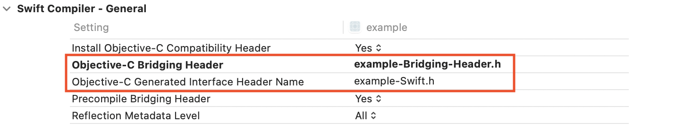

# Huawei AGC React-Native Cloud Functions

---

## Contents

  - [1. Introduction](#1-introduction)
  - [2. Installation Guide](#2-installation-guide)
    - [Creating a Project in App Gallery Connect](#creating-a-project-in-appgallery-connect)
    - [Applying for the Cloud Functions Service](#applying-for-the-cloud-functions-service)
    - [Enabling Cloud Functions Service](#enabling-cloud-functions-service)
    - [Creating a Cloud Function](#creating-a-cloud-function)
    - [Creating a Trigger](#creating-a-trigger)
    - [Integrating the React Native Cloud Functions Plugin](#integrating-the-react-native-cloud-functions-plugin)
        - [Android App Development](#android-app-development)
            - [Integrating the React-Native AGC Cloud Functions into the Android Studio](#integrating-the-react-native-agc-cloud-functions-into-the-android-studio)
        - [iOS App Development](#ios-app-development)
            - [Integrating the React-Native AGC Cloud Functions into the Xcode Project](#integrating-the-react-native-agc-cloud-functions-into-the-xcode-project)
  - [3. API Reference](#3-api-reference)
    - [AGCCloudFunctions](#agccloudfunctions)
    - [AGCFunctionOptions](#agcfunctionoptions) 
    - [AGCTimeUnit](#agctimeunit)
  - [4. Configuration and Description](#4-configuration-and-description)
  - [5. Sample Project](#5-sample-project)
  - [6. Licensing and Terms](#6-licensing-and-terms)

---

## 1. Introduction

This module enables communication between **HUAWEI Cloud Functions Kit** and React Native platform. It exposes all functionality provided by **HUAWEI Cloud Functions Kit** . [For more details, please refer to Getting Started with React Native](https://developer.huawei.com/consumer/en/doc/AppGallery-connect-Guides/agc-get-started-reactnactive-0000001059210314)

---

## 2. Installation Guide

Before you get started, you must register as a HUAWEI Developer and complete identity verification on the [HUAWEI Developer](https://developer.huawei.com/consumer/en/) website. For details, please refer to [Register a HUAWEI ID](https://developer.huawei.com/consumer/en/doc/10104).

### Creating a Project in AppGallery Connect

Creating an app in AppGallery Connect is required in order to communicate with the Huawei services. To create an app, perform the following steps:

**Step 1.** Sign in to [AppGallery Connect](https://developer.huawei.com/consumer/en/service/josp/agc/index.html)  and select **My projects**.

**Step 2.** Select your project from the project list or create a new one by clicking the **Add Project** button.

**Step 3.** Go to **Project Setting** > **General information**, and click **Add app**.
If an app exists in the project and you need to add a new one, expand the app selection area on the top of the page and click **Add app**.

**Step 4.** On the **Add app** page, enter the app information, and click **OK**.

### Applying for the Cloud Functions Service

Cloud Functions is still in Beta state. To use Cloud Functions, send an application email to agconnect@huawei.com to apply for the service.

Set your email title in the following format: [Cloud Functions]-[Company name]-[Developer account ID]-[Project ID]. For details about how to query the developer account ID and project ID, please refer to [Querying the Developer Account ID and Project ID](https://developer.huawei.com/consumer/en/doc/development/AppGallery-connect-Guides/agc-query-ID).

Huawei operation personnel will reply within 1 to 3 working days.

> This email address is used only to process AppGallery Connect service provisioning applications. Do not send other consultations to this email address.

### Enabling Cloud Functions Service

**Step 1.** In [AppGallery Connect](https://developer.huawei.com/consumer/en/service/josp/agc/index.html), find your project, and click the app for which you want to use cloud functions.

**Step 2.** Select **Build** and **Cloud functions** on the left menu and click **Enable Cloud Functions service**.

### Creating a Cloud Function

To create a cloud function, please refer [Create a Function](https://developer.huawei.com/consumer/en/doc/development/AppGallery-connect-Guides/agc-cloudfunction-getstarted#h1-1592364963757).

### Creating a Trigger

To call a function in an app, you must create an HTTP trigger. For details, please refer to [Create an HTTP Trigger](https://developer.huawei.com/consumer/en/doc/development/AppGallery-connect-Guides/agc-cloudfunction-triggercall#h2-1603096955823). When calling a function in an app, you must transfer the identifier of an HTTP trigger. For details, please refer to [Querying the Trigger Identifier](https://developer.huawei.com/consumer/en/doc/development/AppGallery-connect-Guides/agc-cloudfunction-appcall#h1-1578361186845)

### Integrating the React-Native Cloud Functions Plugin

Before using **@hw-agconnect/react-native-cloudfunctions**, ensure that the ReactNative development environment has been installed.

#### Install via NPM

```
npm i @hw-agconnect/react-native-cloudfunctions
```

#### Android App Development

##### Integrating the React-Native AGC Cloud Functions into the Android Studio

- Add the AppGallery Connect configuration file of the app to your Android Studio project.

    **Step 1:** Sign in to [AppGallery Connect](https://developer.huawei.com/consumer/en/service/josp/agc/index.html) and click **My projects**.

    **Step 2:** Find your **app** project and click the app.

    **Step 3:** Go to **Project Setting > App information**. In the **App information** area, download the **agconnect-services.json** file.

    **Step 4:** Copy the **agconnect-services.json** file to the app's root directory of your project.

- Open the **build.gradle** file in the **android** directory of your React Native project. Navigate into **buildscript**, configure the Maven repository address and agconnect plugin.

    ```groovy
    buildscript {
    repositories {
        google()
        jcenter()
        maven { url 'https://developer.huawei.com/repo/' }
    }

    dependencies {
        /*
         * <Other dependencies>
         */
        classpath 'com.huawei.agconnect:agcp:1.9.1.301'
    }
    }
    ```

- Go to **allprojects** then configure the Maven repository address.

    ```groovy
    allprojects {
    repositories {
        /*
         * <Other repositories>
         */  
        maven { url 'https://developer.huawei.com/repo/' }
    }
    }
    ```

- Open the **build.gradle** file in the **android/app** directory of your React Native project.

    Set your package name in **defaultConfig** > **applicationId** and set **minSdkVersion** to **19** or **higher**.

    ```groovy
    defaultConfig {
     applicationId "<package_name>"
     minSdkVersion {{your_min version}}
     /*
      * <Other configurations>
      */
    }
    ```

    **Package name must match with the _package_name_ entry in _agconnect-services.json_ file.**

- Configure the signature file.

    ```gradle
    android {
        /*
         * <Other configurations>
         */

        signingConfigs {
            config {
                storeFile file('<keystore_file>.jks')
                storePassword '<keystore_password>'
                keyAlias '<key_alias>'
                keyPassword '<key_password>'
            }
        }

        buildTypes {
            debug {
                signingConfig signingConfigs.config
            }
            release {
                signingConfig signingConfigs.config
            }
        }
    }
    ```

#### iOS App Development

##### Integrating the React-Native AGC Cloud Functions into the Xcode Project

- Navigate into your project directory and run below command.

  ```
    [project_path]> cd ios/ && pod install
  ```

- Add the AppGallery Connect configuration file of the app to your Xcode project.

    **Step 1:** Sign in to [AppGallery Connect](https://developer.huawei.com/consumer/en/service/josp/agc/index.html) and click **My projects**.
    
    **Step 2:** Find your **app** project and click the app.
    
    **Step 3:** Go to **Project Setting > App information**. In the **App information** area, download the **agconnect-services.plist** file.
    
    **Step 4:** Copy the **agconnect-services.plist** file to the app's root directory of your Xcode project.
    
    Before obtaining the **agconnect-services.plist** file, ensure that you have enabled HUAWEI Cloud Functions. For details, please refer to [Enabling HUAWEI Cloud Functions](#enabling-cloud-functions-service).
    
    If you have made any changes on the Project Setting page, such as setting the data storage location and enabling or managing APIs, you need to download the latest **agconnect-services.plist** file and replace the existing file in the app's root directory.

- Initialize the AGConnect Core Sdk.

    After the **agconnect-services.plist** file is imported successfully, initialize the AGConnect Core SDK using the config API in AppDelegate.
    
    Swift sample code for initialization in **AppDelegate.swift**:
    
    ```swift
    import AGConnectCore
 
    @UIApplicationMain
    class AppDelegate: UIResponder, UIApplicationDelegate {
    ...
    func Application(_ Application: UIApplication, didFinishLaunchingWithOptions launchOptions: [UIApplication.LaunchOptionsKey: Any]?) -> Bool  {
        // Override point for customization after Application launch.
        AGCInstance.startUp();//Initialization
        return true
    }
    ...
    }
    ```

    Objective-C sample code for initialization in **AppDelegate.m**:
    
    ```objc
    #import <AGConnectCore/AGConnectCore.h>

    @implementation AppDelegate

    - (BOOL)application:(UIApplication *)application didFinishLaunchingWithOptions:(NSDictionary *)launchOptions
    {
    ...
    [AGCInstance startUp];
    return YES;
    }
    ...
    @end
    ```

- All the React-Native AGC Cloud Functions plugin implementations are written in **swift**.

    Make sure your **Xcode target -> Swift Compiler - General tab** includes **Objective-C Bridging Header** and **Objective-C Generated Interface Header Name** like below:

     

---

## 3. API Reference

### Module Overview

| Module        | Description|
| ------------- | -------------------------------------------- |
| [AGCCloudFunctions](#agccloudfunctions)  | Initializes an FunctionCallable instance and calls the cloud function. |
| [AGCFunctionOptions](#agcfunctionoptions)  | Cloud function configurations and parameters. |
| [AGCTimeUnit](#agctimeunit)  | Enum of TimeUnits. |

### AGCCloudFunctions

#### Method Summary

| Method                                    |Return Type        |Description                                   |
|:------------------------------------------|-------------------|:---------------------------------------------|
| [call(triggerIdentifier, options)](#call) | `object` | Configures and calls the cloud function. |

#### Methods

##### <a name="call"></a>AGCCloudFunctions.call(triggerIdentifier, options)

Configures and calls the cloud function.

###### Parameters

| Name    | Type                  | Description            |
| ------- | --------------------- | ---------------------- |
| triggerIdentifier   | `string` | HTTP trigger identifier of the cloud function to be called. For details about how to query the HTTP trigger identifier, see [Querying the Trigger Identifier](https://developer.huawei.com/consumer/en/doc/development/AppGallery-connect-Guides/agc-cloudfunction-appcall#httptriggerurl).  |
| options   | [AGCFunctionOptions](#agcfunctionoptions) | Cloud function configurations and parameters. This parameter is optional. |
###### Return Type

|Return Type     | Description                                     |
|:---------------|:------------------------------------------------|
| `object` | The return value after the function is executed |

###### Call Example

```js
import AGCCloudFunctions, {
  AGCTimeUnit,
} from "@hw-agconnect/react-native-cloudfunctions";

const triggerIdentifier = "<your_trigger_identifier>";

const options = {
  timeout: 1000,
  timeUnit: AGCTimeUnit.SECONDS,
  params: {
    key1: "testString",
    key2: 123
  }
}

AGCCloudFunctions.call(triggerIdentifier, options)
  .then(response => {
   console.log(response);
  })
  .catch((error) => {
    console.log("Error", error.toString());
  });
```

### AGCFunctionOptions

Cloud function configurations and parameters.

| Name    | Type                  | Description            |
| ------- | --------------------- | ---------------------- |
| timeout   | `number` | Timeout interval of a function. For **Android** the unit is defined by the timeUnit parameter and the default time unit is **seconds**. For **iOS** time unit is **seconds** |
| timeUnit   | [AGCTimeUnit](#AGCtimeunit) | Defines the time unit. *Android Only*  |
| params   | `object` | Custom object that contains input parameter values of the function, which can be of any type.  |

### AGCTimeUnit

Enum of TimeUnits

#### Constants

| Value  | Type     | Field                            | Description      |
| ------ | -------- | -------------------------------- | ---------------- |
| 0      | `number` | AGCTimeUnit.NANOSECONDS          | Nanoseconds.     |
| 1      | `number` | AGCTimeUnit.MICROSECONDS         | Microsecons.     |
| 2      | `number` | AGCTimeUnit.MILLISECONDS         | Milliseconds.    |
| 3      | `number` | AGCTimeUnit.SECONDS              | Secons.          |
| 4      | `number` | AGCTimeUnit.MINUTES              | Minutes.         |
| 5      | `number` | AGCTimeUnit.HOURS                | Hours.           |
| 6      | `number` | AGCTimeUnit.DAYS                 | Days.            |

---

## 4. Configuration and Description

- [Using the Debug Mode for Android and iOS platforms](https://developer.huawei.com/consumer/en/doc/development/HMS-Plugin-Guides/enabling-debug-mode-0000001050132798)

### Configuring Obfuscation Scripts

Before building the APK, configure obfuscation scripts to prevent the AppGallery Connect SDK from being obfuscated. If obfuscation arises, the AppGallery Connect SDK may not function properly.

```
-ignorewarnings
-keepattributes *Annotation*
-keepattributes Exceptions
-keepattributes InnerClasses
-keepattributes Signature
-keep class com.hianalytics.android.**{*;}
-keep class com.huawei.updatesdk.**{*;}
-keep class com.huawei.hms.**{*;}
-keep class com.huawei.agc.**{*;}
-keep class com.huawei.agconnect.**{*;}
-repackageclasses
```

---

## 5. Sample Project

This plugin includes a demo project in the [example](example) folder, there you can find more usage examples.

---

## 6. Licensing and Terms

AGC React-Native Plugin is licensed under [Apache 2.0 license](LICENCE)
